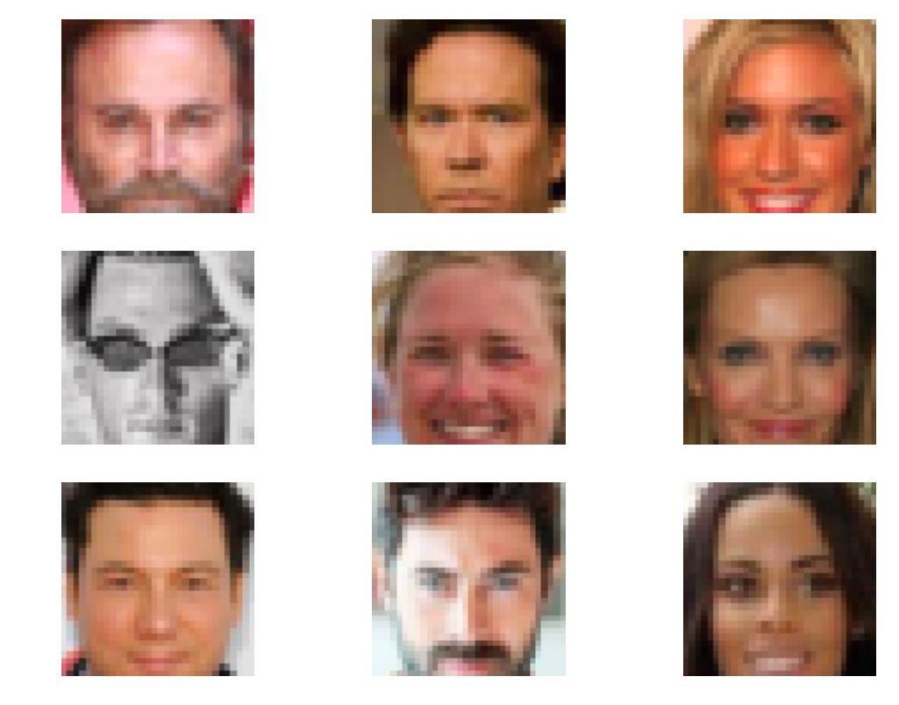
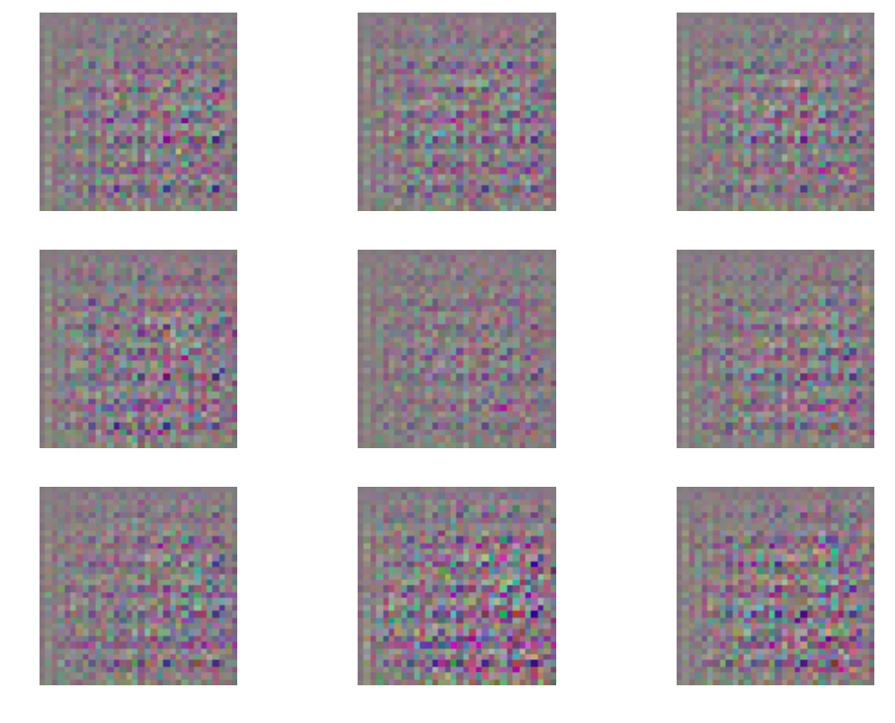
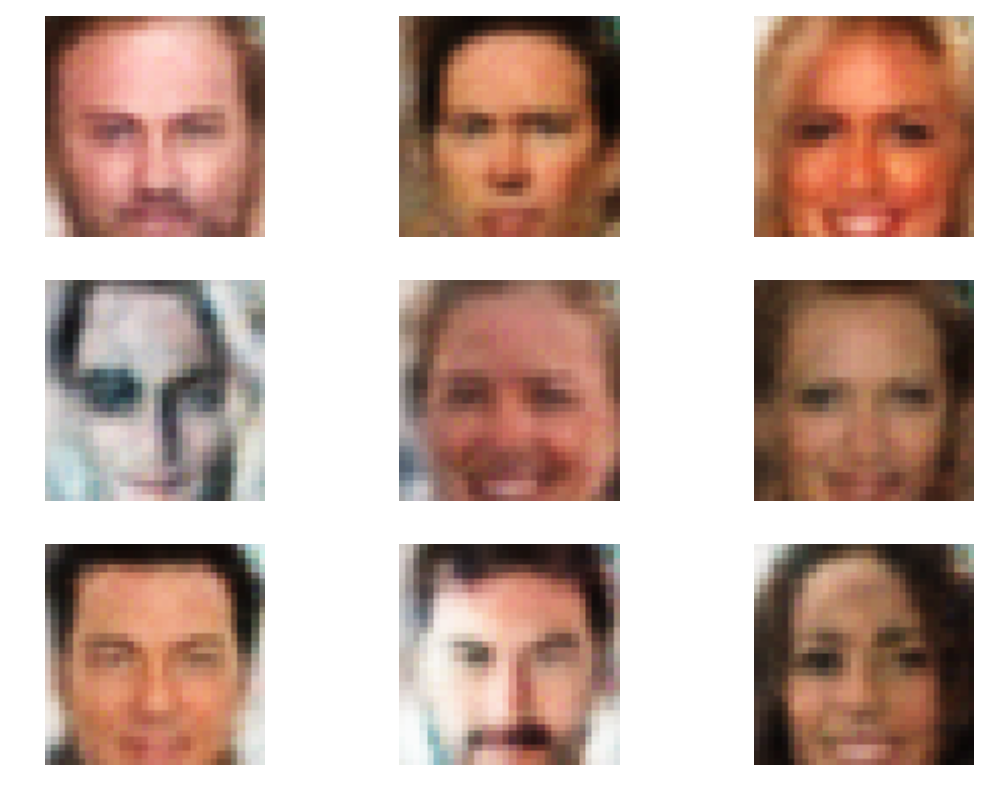
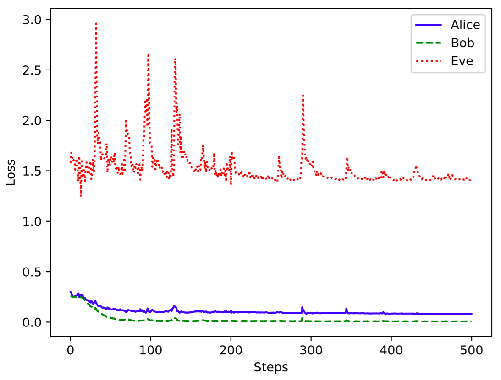
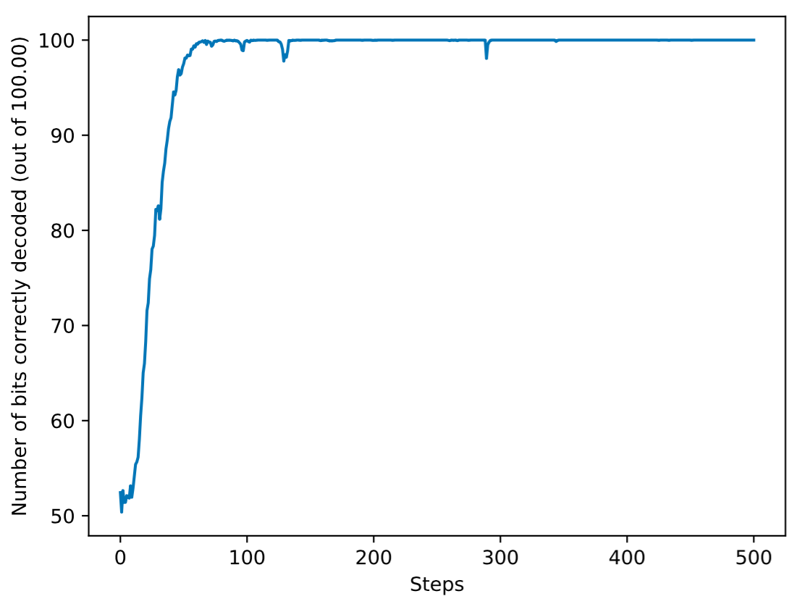

# Generating Steganographic Images via Adversarial Training

This is a toy example (on CelebA) of how to run experiments presented in https://arxiv.org/abs/1703.00371

## To run

1. Download CelebA dataset and save to `./data`
2. Run `python main.py`

## Results 

Example of real images. 

Example of Alice generated images at Epoch 0. 

Example of Alice generated images at Epoch 500. 

Loss plots.

Bob decoding success.

## Notes

Hyperparameter optimization is needed for optimal results (and other tweaks like using high capacity networks).
